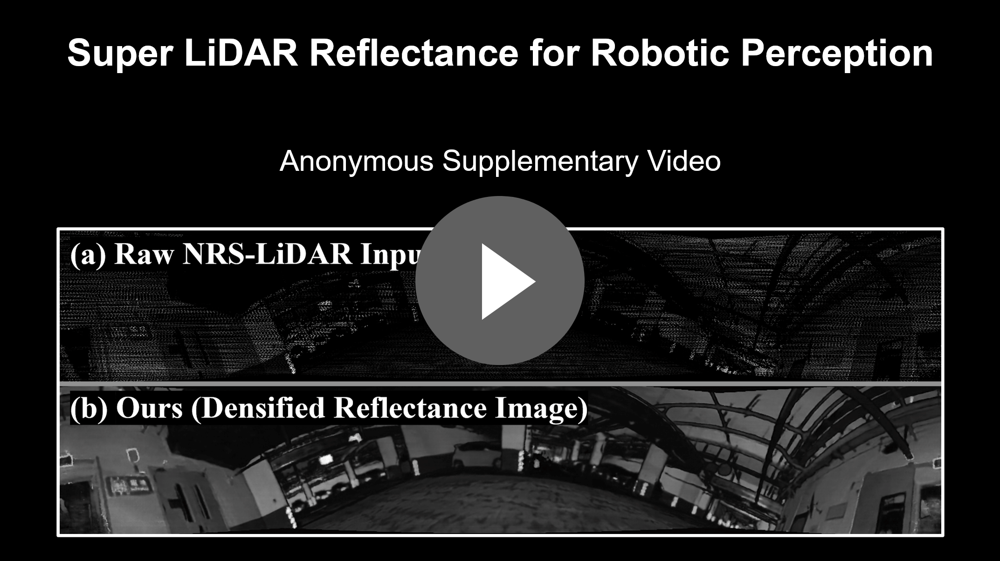

### Super-LiDAR-Intensity

This is the code repository for the IEEE-RAL'26 paper "Super LiDAR Intensity for Robotic Perception"
[](https://youtu.be/KdErU4dGM5E)

Coming soon...

### Reference

```
@article{gao2025super,
  title={Super LiDAR Intensity for Robotic Perception},
  author={Gao, Wei and Zhang, Jie and Zhao, Mingle and Zhang, Zhiyuan and Kong, Shu and Ghaffari, Maani and Song, Dezhen and Xu, Cheng-Zhong and Kong, Hui},
  journal={arXiv preprint arXiv:2508.10398},
  year={2025}
}
```

