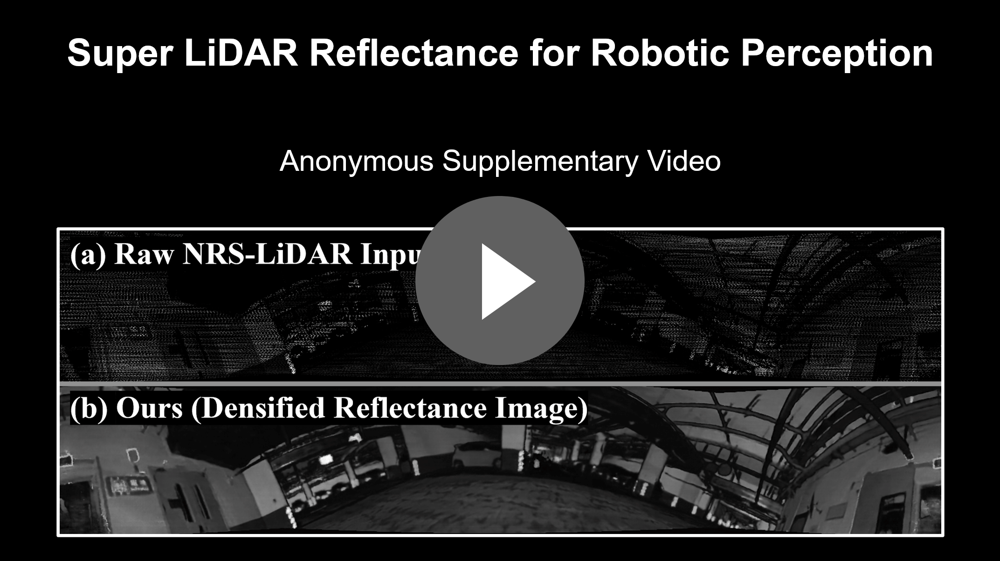
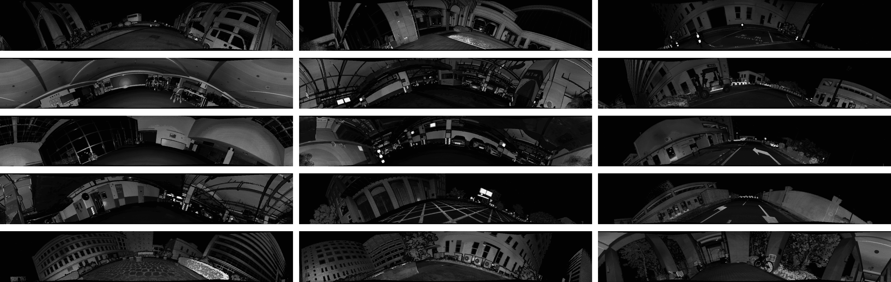

### Super-LiDAR-Intensity

This is the code repository for the IEEE-RAL'26 paper "Super LiDAR Intensity for Robotic Perception"
[](https://youtu.be/C5PahLDyoVY)

Coming soon...

# Dataset Display




## Usage:
#Data Preparation:
Generate Intensity Image from ROSbag:
1.
2.
3.

The repository has been tested in Ubuntu 20.04 with ROS Noetic. To set up Super-LiDAR-Intensity, install the dependencies with command lines below.
1. Dependencies

2. 
### Reference

```
@article{gao2025super,
  title={Super LiDAR Intensity for Robotic Perception},
  author={Gao, Wei and Zhang, Jie and Zhao, Mingle and Zhang, Zhiyuan and Kong, Shu and Ghaffari, Maani and Song, Dezhen and Xu, Cheng-Zhong and Kong, Hui},
  journal={arXiv preprint arXiv:2508.10398},
  year={2025}
}
```

